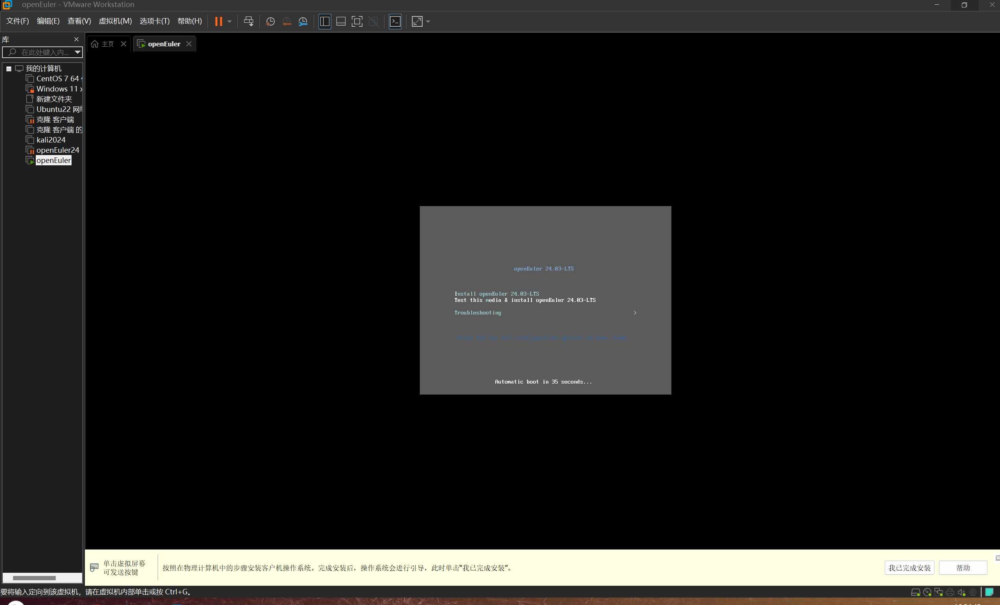
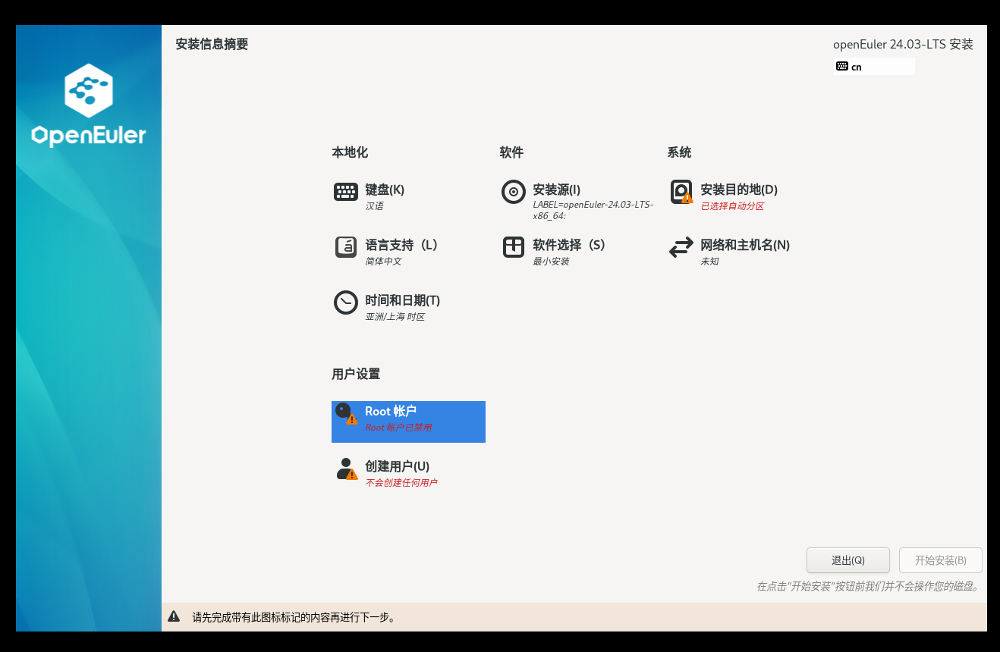
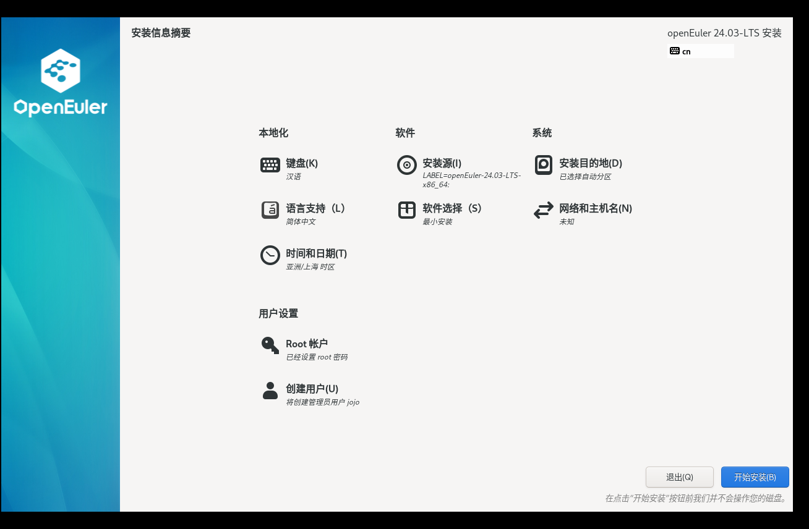
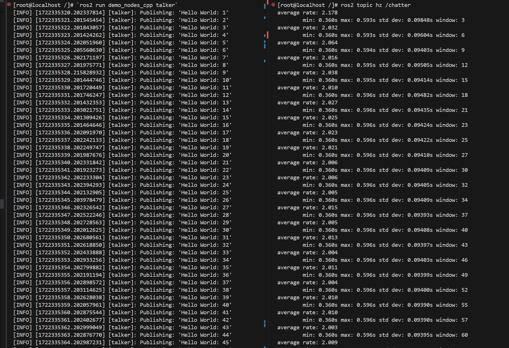
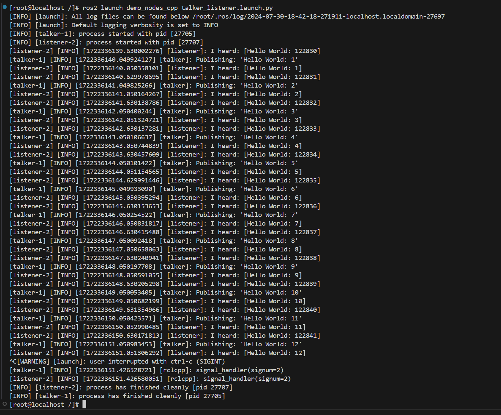
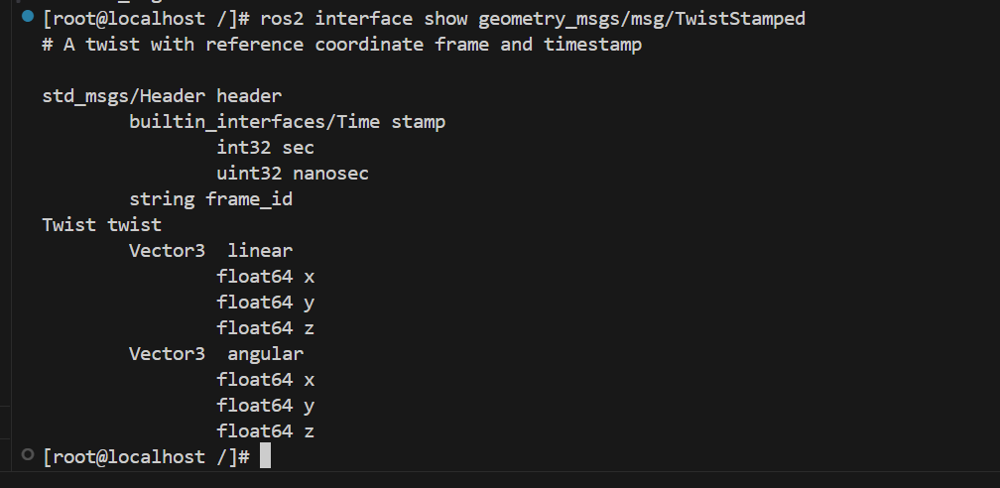
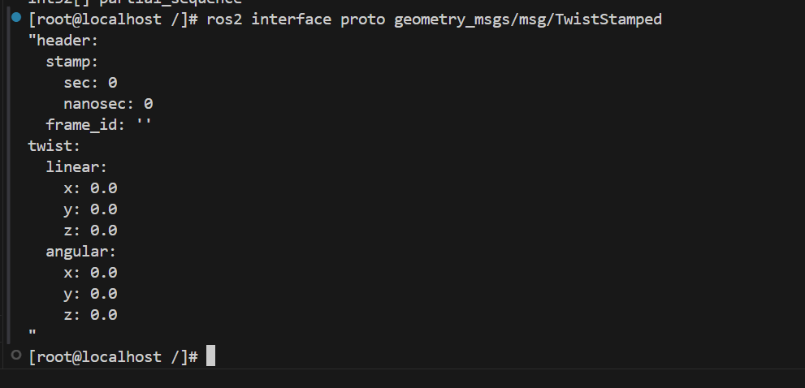
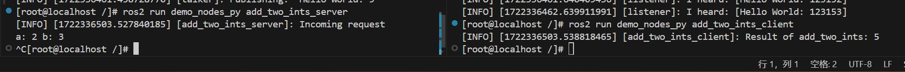

# ROS2 Humble 在 openEuler-24.03-x86 上的测试

## 环境信息

#### 硬件信息

1. 处理器 13th Gen Intel(R) Core(TM) i9-13900HX   2.20 GHz
2. 内存 64.0 GB

#### 软件信息

1. 宿主机操作系统：Windows 11  version 23H2
2. OS 版本：openEuler-24.03-x86
3. vmware Workstation Pro 17.0.0 build-20800274
4. 镜像地址：[https://www.openeuler.org/zh/download/?version=openEuler%2024.03%20LTS](https://)
5. 软件源：[http://121.36.84.172/dailybuild/EBS-openEuler-24.03-LTS/EBS-openEuler-24.03-LTS/EPOL/multi_version/ROS/humble/x86_64/](https://)

## 安装、配置并启动OpenEuler

前往官网，下载 镜像文件

使用vmware创建虚拟机


### 注意：这里没有Linux6.6内核选项，所以选了5.x版本，实测对系统运行没有影响


### 创建完成，启动虚拟机，选则第一个选项 lnstall openEuler 24.03-LTS





### 创建Root账户和用户


### 安装位置，选择本地磁盘


### 配置完毕，开始安装




### 输入用户名，密码，成功登录


- 用户名：`root`
- 密码：`qwer666!`
- 用户名：`jojo`
- 密码：`qwer666!`

## 测试安装

### 安装OpenVMwareTool，为了主机粘代码 到虚拟机上

### 注意： 不是VM左上角点下挂载到CDROM的这个VMwareTool，实测没法安装这个VMwareTool。解决了一个semanage找不到的问题，还有其他服务跑不起来


### 后面在上网查到，要安装OpenVMwareTool


### 修改ROS仓库源

执行以下命令

```bash
bash -c 'cat << EOF > /etc/yum.repos.d/ROS.repo
[openEulerROS-humble]
name=openEulerROS-humble
baseurl=http://121.36.84.172/dailybuild/EBS-openEuler-24.03-LTS/EBS-openEuler-24.03-LTS/EPOL/multi_version/ROS/humble/x86_64/
enabled=1
gpgcheck=0
EOF'
```

### 安装

```bash
dnf install "ros-humble-*" --skip-broken --exclude=ros-humble-generate-parameter-library-example
```

安装成功,完整日志见 [dnf_install.log](./logs/dnf_install.log)

安装上述软件列表后，编辑 `~/.bashrc` 追加以下内容

```bash
source /opt/ros/humble/setup.sh
```

随后输入 `source  ~/.bashrc`来激活ROS2环境


## 安装XFCE桌面

安装字库

```
# sudo dnf install dejavu-fonts liberation-fonts gnu-*-fonts google-*-fonts
```

安装Xorg

```
# sudo dnf install xorg-*
```

安装XFCE及组件

```
# sudo dnf install xfwm4 xfdesktop xfce4-* xfce4-*-plugin network-manager-applet *fonts
```

安装登录管理器

```
# sudo dnf install lightdm lightdm-gtk
```

设置默认桌面为XFCE 通过root权限用户设置

```
# echo 'user-session=xfce' >> /etc/lightdm/lightdm.conf.d/60-lightdm-gtk-greeter.conf
```

使用登录管理器登录XFCE

```
# sudo systemctl start lightdm
```

登录管理器启动后，在右上角左侧选择"xfce-session" 输入用户名、密码登录

设置开机自启动图形界面

```
# sudo systemctl enable lightdm
# sudo systemctl set-default graphical.target
```

重启验证

```
# sudo reboot
```

## 安装UKUI桌面

安装字体

```
sudo dnf -y groupinstall fonts
```

安装UKUI

```
sudo dnf -y install ukui
```

设置图形启动

```
sudo systemctl set-default graphical.target
```

重启电脑

## 测试用例列表及测试结果

测试用例列表如下


| 测试用例名                  | 状态 |
| --------------------------- | ---- |
| 测试 turtlesim功能          | 成功 |
| 测试ros2 pkg create         | 成功 |
| 测试ros2 pkg executables    | 成功 |
| 测试ros2 pkg list           | 成功 |
| 测试ros2 pkg prefix         | 成功 |
| 测试ros2 pkg xml            | 成功 |
| 测试ros2 run                | 成功 |
| 测试ros2 topic list         | 成功 |
| 测试ros2 topic info         | 成功 |
| 测试ros2 topic type         | 成功 |
| 测试ros2 topic find         | 成功 |
| 测试ros2 topic hz           | 成功 |
| 测试ros2 topic bw           | 成功 |
| 测试ros2 topic echo         | 成功 |
| 测试ros2 param 工具         | 成功 |
| 测试ros2 service 工具       | 成功 |
| 测试ros2 node list          | 成功 |
| 测试ros2 node info          | 成功 |
| 测试ros2 bag 工具           | 成功 |
| 测试ros2 launch 工具        | 成功 |
| 测试ros2 interface list     | 成功 |
| 测试ros2 interface package  | 成功 |
| 测试ros2 interface packages | 成功 |
| 测试ros2 interface show     | 成功 |
| 测试ros2 interface proto    | 成功 |
| 测试 ros 通信组件相关功能   | 成功 |

失败的测试用例如下:


| 测试用例名         | 状态 |
| ------------------ | ---- |
| 测试 turtlesim功能 | 失败 |

结论：当前由于oERV 24.03的原因没有桌面，因此turtlesim相关的功能均无法使用。

## 测试 ros 基础工具相关功能

#### 1 ros2 pkg 工具

##### 1.1 ros2 pkg create

执行 `ros2 pkg create riscv-ros-pkg`，输出如下，且当前目录存在相应文件夹，测试通过


##### 1.2 ros2 pkg executables

执行 `ros2 pkg executables turtlesim`，输出如下，测试通过


##### 1.3 ros2 pkg list

执行 `ros2 pkg list`，输出如下，测试通过


##### 1.4 ros2 pkg prefix

执行 `ros2 pkg prefix turtlesim`，输出如下，测试通过


##### 1.5 ros2 pkg xml

执行 `ros2 pkg xml turtlesim`，输出如下，测试通过


#### 2 ros2 run 工具

执行 `ros2 run demo_nodes_cpp talker`，输出如下，测试通过


#### 3 ros2 topic 工具

##### 3.1 ros2 topic list

执行  `ros2 topic list`，输出如下，测试通过


##### 3.2 ros2 topic info

执行 `ros2  topic info /rosout`，输出如下，测试通过


##### 3.3 ros2 topic type

执行 `ros2 topic type /rosout`，输出如下，测试通过


##### 3.4 ros2 topic find

执行 `ros2 topic find rcl_interfaces/msg/Log`，输出如下， 测试通过

!

##### 3.5 ros2 topic hz

分别执行命令 `ros2 run demo_nodes_cpp talker`，`ros2 topic hz /chatter`，输出如下，测试通过


##### 3.6 ros2 topic bw

分别执行命令 `ros2 run demo_nodes_cpp talker`，`ros2 topic bw /chatter`，输出如下，测试通过



##### 3.7 ros2 topic echo

分别执行命令 `ros2 run demo_nodes_cpp talker`，`ros2 topic echo /chatter`，输出如下，测试通过


#### 4 ros2 param 工具

分别执行命令 `ros2 run demo_nodes_cpp talker`, `ros2 param list`，输出如下，测试通过


#### 5 ros2 service 工具

分别执行命令 `ros2 run demo_nodes_cpp talker`, `ros2 service list`，输出如下，测试通过


#### 6 ros2 node 工具

##### 6.1 ros2 node list

分别执行命令 `ros2 run demo_nodes_cpp talker`, `ros2 node list`，输出如下，测试通过


##### 6.2 ros2 node info

分别执行命令 `ros2 run demo_nodes_cpp talker`, `ros2 node info /talker`，输出如下，测试通过


#### 7 ros2 bag 工具

输入 `ros2 bag record -a`,

检查当前目录，如下，测试通过


ros2 bag info 工具

执行 `ros2 bag info rosbag2_2023_11_23-21_48_31/rosbag2_2023_11_23-21_48_31_0.db3 ` （文件由上一步骤生成）命令，输出如下，测试通过


执行 `ros2 bag play rosbag2_2023_11_23-21_48_31/rosbag2_2023_11_23-21_48_31_0.db3` 命令，输出如下，测试通过


#### 8 ros2 launch 工具

输入 `ros2 launch demo_nodes_cpp talker_listener.launch.py`，输出如下，测试通过

!

#### 9 ros2 interface 工具

##### 9.1 ros2 interface list

分类显示系统内所有的接口，包括消息（Messages）、服务（Services）、动作（Actions）。

执行 `ros2 interface list` ，输出如下，测试通过


##### 9.2 ros2 interface package

显示指定接口包内的子接口。

执行 `ros2 interface package action_msgs` ，输出如下，测试通过


##### 9.3 ros2 interface packages

显示指定接口包。

执行 `ros2 interface packages` 输出如下，测试通过


##### 9.4 ros2 interface show

显示指定接口的详细内容。

用于消息类型 Messsage：执行 `ros2 interface show geometry_msgs/msg/TwistStamped` ，输出如下，测试通过



用于服务 Service：执行 `ros2 interface show action_msgs/srv/CancelGoal` ，输出如下，测试通过


用于动作 Action：执行 `ros2 interface show action_tutorials_interfaces/action/Fibonacci` ，输出如下，测试通过


##### 9.5 ros2 interface proto

显示消息模板。

执行 `ros2 interface proto geometry_msgs/msg/TwistStamped` ，输出如下，测试通过



#### 10.测试 ros 通信组件相关功能

##### 10.1 topic 通信

###### c++ 实现

分别执行 `ros2 run demo_nodes_cpp talker` 和 `ros2 run demo_nodes_cpp listener`，输出如下，测试通过

!

###### python 实现

分别执行 `ros2 run demo_nodes_py talker` 和 `ros2 run demo_nodes_py listener`，输出如下，测试通过

!

##### 10.2 service 通信

###### c++ 实现

分别执行 `ros2 run demo_nodes_cpp add_two_ints_server` 和 `ros2 run demo_nodes_cpp add_two_ints_client`，输出如下，测试通过


###### python 实现

分别在两个终端执行 `ros2 run demo_nodes_py add_two_ints_server` 和 `ros2 run demo_nodes_py add_two_ints_client`，输出如下，测试通过



##### 10.3 测试 ros 坐标转换相关功能

###### 坐标转换的发布和订阅

分别在两个终端执行 `ros2 run tf2_ros static_transform_publisher 1 1 1 0 0 0 /base_link /odom` 和 `ros2 run tf2_ros tf2_echo base_link odom`，输出如下，测试通过


###### tf_monitor 监控

分别在两个终端执行 `ros2 run tf2_ros static_transform_publisher 1 1 1 0 0 0 /base_link /odom` 和 `ros2 run tf2_ros tf2_monitor`，输出如下，测试通过


###### 10.4 view_frames 保存 pdf

分别在两个终端执行 `ros2 run tf2_ros static_transform_publisher 1 1 1 0 0 0 /base_link /odom` 和 `ros2 run tf2_tools view_frames`，输出如下，且存在 pdf 文件，测试通过


#### 11 测试 turtlesim

分别在两个终端执行 `ros2 run turtlesim turtlesim_node` 和 `ros2 run turtlesim turtle_teleop_key`

测试通过

在XFCE桌面下


在UKUI桌面下


