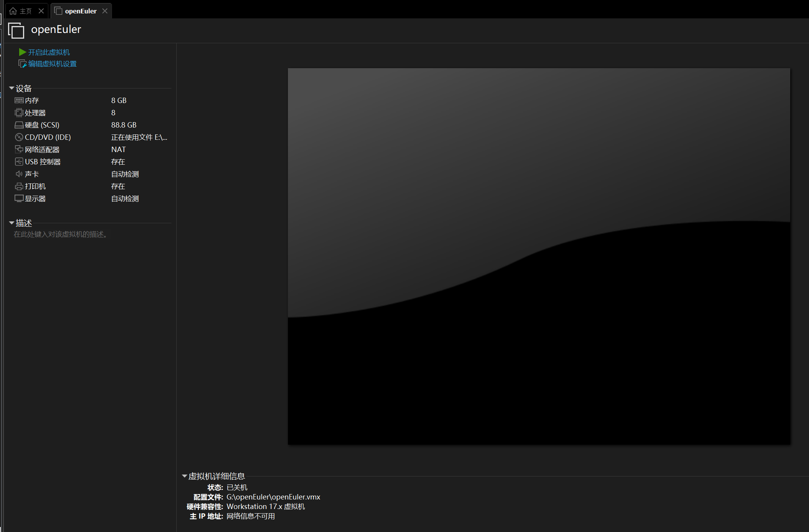
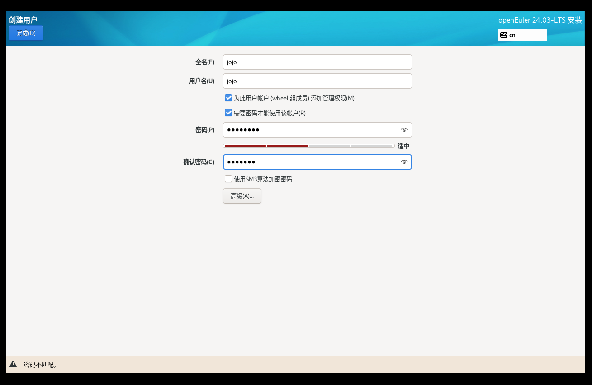
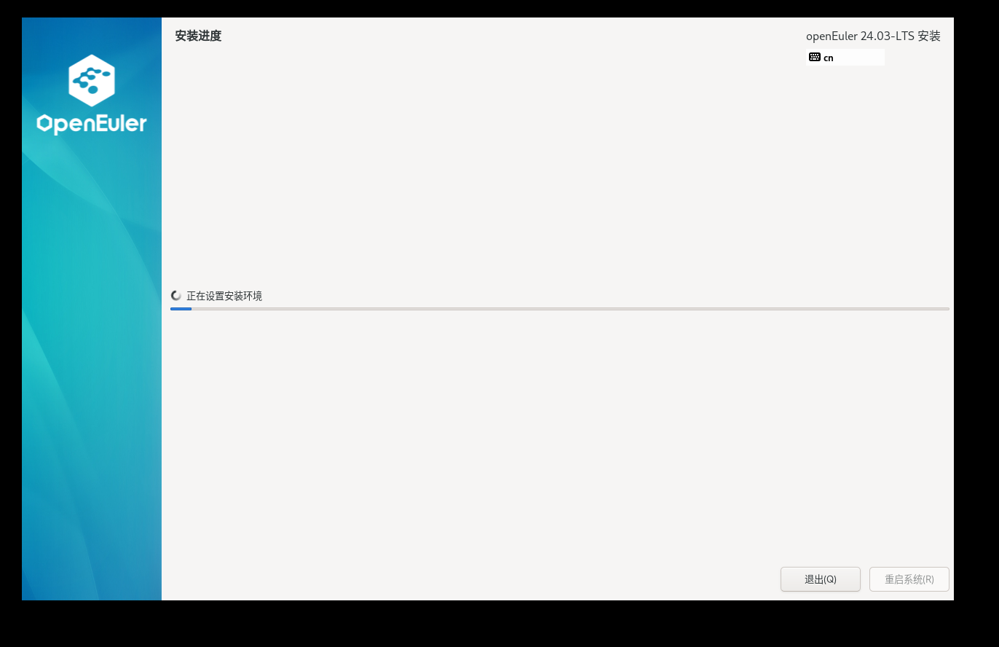
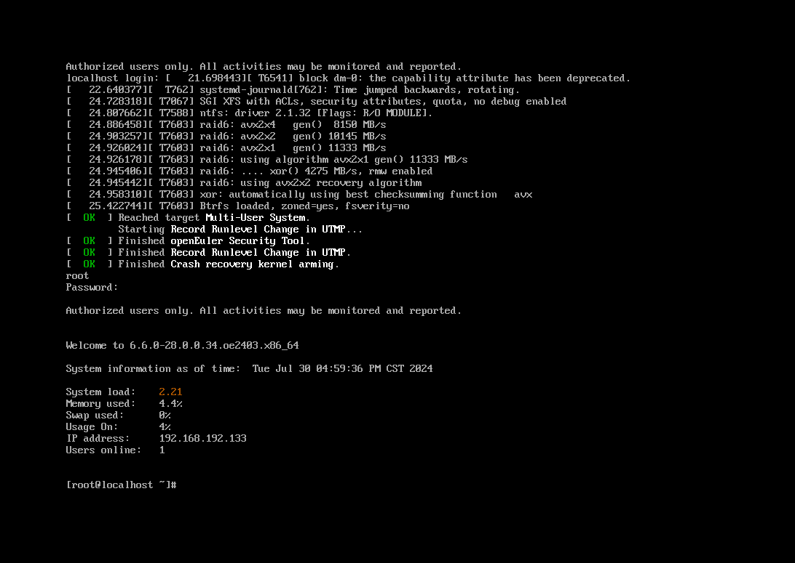
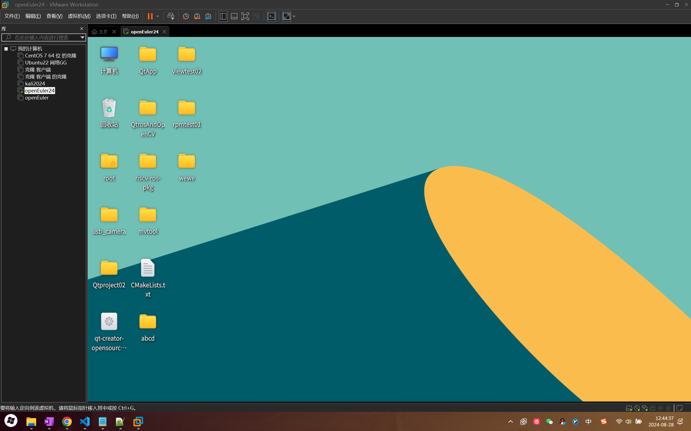

# VMWare安装openEuler24.03操作系统

## 1.安装VMWare虚拟机

#### 软件信息

1. 宿主机操作系统：Windows 11  version 23H2
2. OS 版本：openEuler-24.03-x86
3. vmware Workstation Pro 17.0.0（ 注意：请自行注册激活软件，本文档不涉及任何破解激活等侵权操作，       vmware 17 下载，安装可参考此链接[https://blog.csdn.net/Du_XiaoNan/article/details/136138427](https://) ）
4. OpenEuler 镜像地址：[https://www.openeuler.org/zh/download/?version=openEuler%2024.03%20LTS](https://)

## 2.安装openEuler24.03系统

前往官网，下载 镜像文件

使用vmware创建虚拟机


### 注意：这里没有Linux6.6内核选项，所以选了5.x版本，实测对系统运行没有影响




### 创建完成，启动虚拟机，选则第一个选项 lnstall openEuler 24.03-LTS


### 创建Root账户和用户




### 安装位置，选择本地磁盘


### 配置完毕，开始安装





### 输入用户名，密码，成功登录



- 用户名：`root`
- 密码：`qwer666!`
- 用户名：`jojo`
- 密码：`qwer666!`

## 安装桌面环境

安装字库

```
# sudo dnf install dejavu-fonts liberation-fonts gnu-*-fonts google-*-fonts
```

安装Xorg

```
# sudo dnf install xorg-*
```

安装XFCE及组件

```
# sudo dnf install xfwm4 xfdesktop xfce4-* xfce4-*-plugin network-manager-applet *fonts
```

安装登录管理器

```
# sudo dnf install lightdm lightdm-gtk
```

设置默认桌面为XFCE 通过root权限用户设置

```
# echo 'user-session=xfce' >> /etc/lightdm/lightdm.conf.d/60-lightdm-gtk-greeter.conf
```

使用登录管理器登录XFCE

```
# sudo systemctl start lightdm
```

登录管理器启动后，在右上角左侧选择"xfce-session" 输入用户名、密码登录

设置开机自启动图形界面

```
# sudo systemctl enable lightdm
# sudo systemctl set-default graphical.target
```

重启验证

```
# sudo reboot
```

## 安装UKUI桌面

安装字体

```
sudo dnf -y groupinstall fonts
```

安装UKUI

```
sudo dnf -y install ukui
```

设置图形启动

```
sudo systemctl set-default graphical.target
```

重启电脑，成功如下


