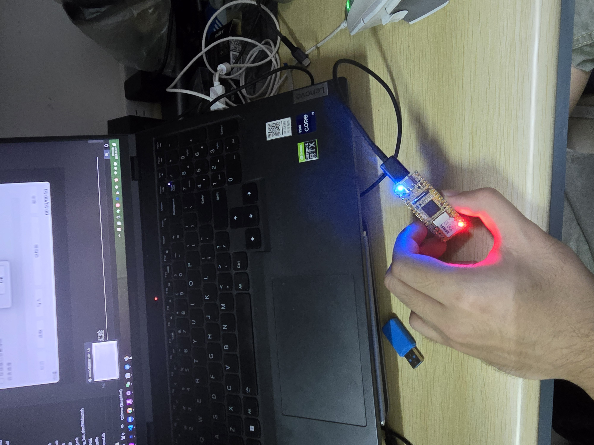
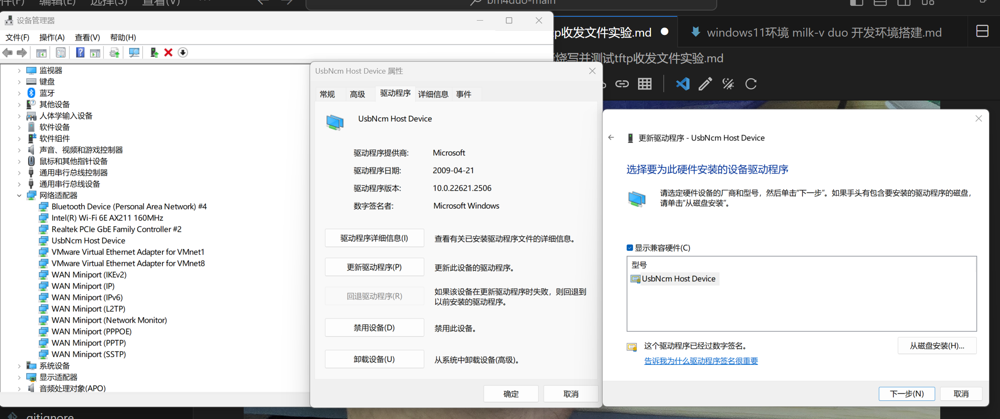
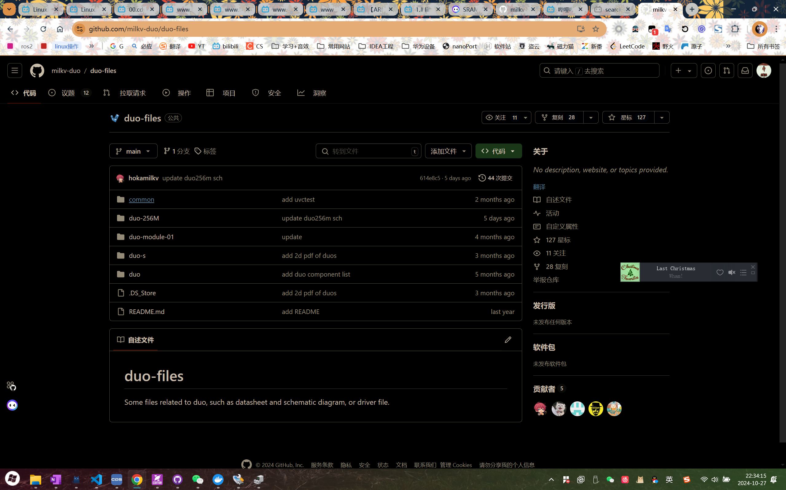
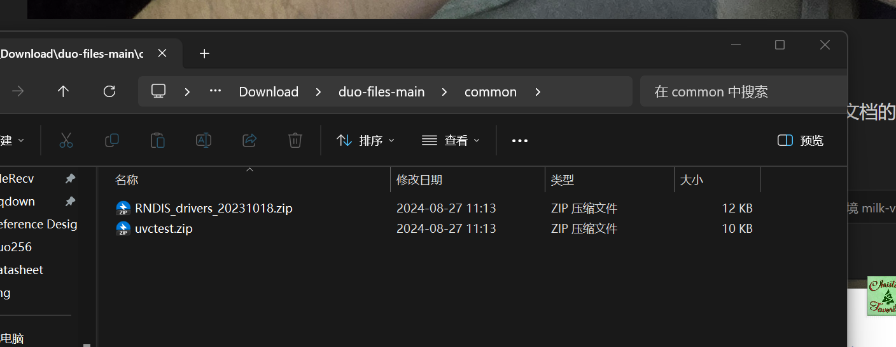
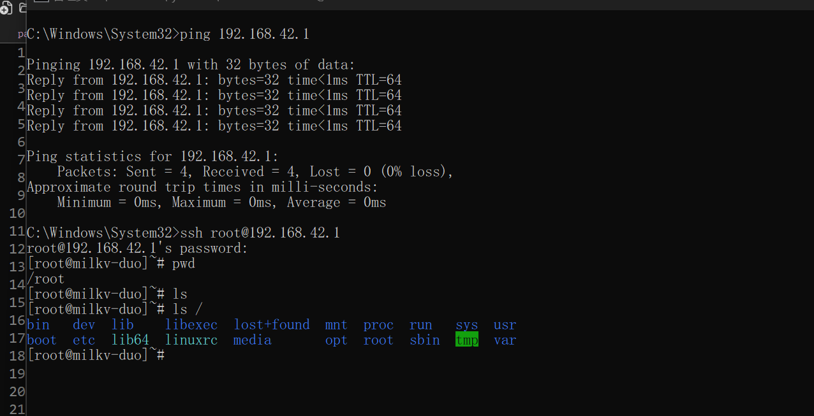
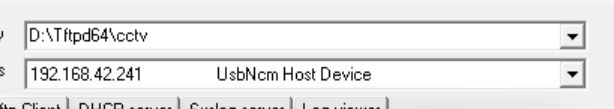
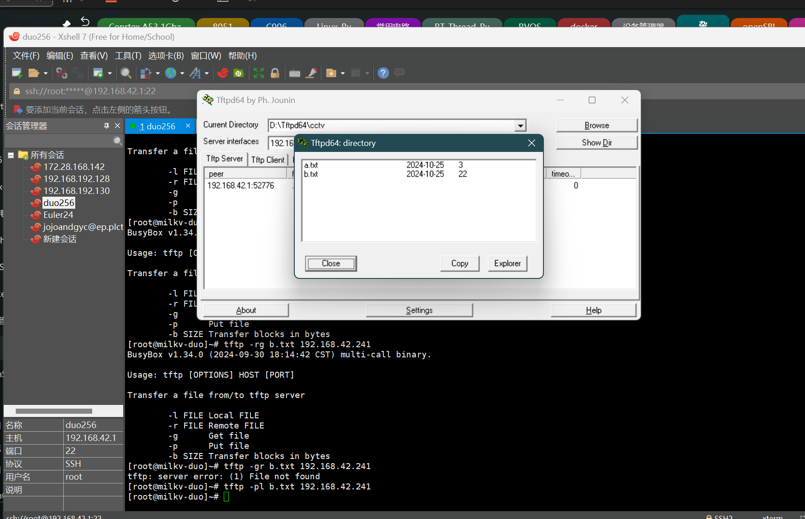

# milk-v duo SDK编译烧写并测试tftp收发文件

## 准备材料

1, Type-C 数据线 ，milk-v duo256 开发板 ，tf卡烧写器，tf卡

2,下载项目源码[ Milk-v duo SDK  https://github.com/milkv-duo/duo-buildroot-sdk ](https://github.com/milkv-duo/duo-buildroot-sdk) ，

3, 下载软件 [Tftpd64     https://bitbucket.org/phjounin/tftpd64/wiki/Download%20Tftpd64.md](https://bitbucket.org/phjounin/tftpd64/wiki/Download%20Tftpd64.md) 和 [docker-desktop    https://www.docker.com/products/docker-desktop/](https://www.docker.com/products/docker-desktop/) 和 [win32DiskImager https://sourceforge.net/projects/win32diskimager/](https://sourceforge.net/projects/win32diskimager/)

## 编译烧写Milk-v duo buildroot SDK 实验

编译部分参考 Milk-v duo 官网文档使用 docker 编译，[https://milkv.io/zh/docs/duo/getting-started/buildroot-sdk](https://milkv.io/zh/docs/duo/getting-started/buildroot-sdk)

再Docker中编译完成后，打卡 Docker Desktop 保存SDK编译出的 img文件到 本地主机，

使用 win32DiskImager 烧写 img 文件到 tf卡 ，然后将烧写完成后的 tf 卡插入 milk-v duo 开发板即可，

type-c 数据线连接duo开发板后，需要将 连接设备驱动更改为 UsbNCM 驱动 ，

或是RNDIS驱动，在milk-v duo官方github文件仓库下的common文件夹下 [https://github.com/milkv-duo/duo-files](https://github.com/milkv-duo/duo-files)，

ping 连接测试，ssh连接测试，duo开发板上 默认IP 为192.168.42.1 ，用户root，密码milkv

## tftp文件传输实验

打开tftp64 ，界面如下

需要设置 服务器目录，服务器接口，milk-v duo开发板上通过 tftp 命令就可以往服务器目录里 上传或下载 文件，

注意，这里的服务器接口 需要选择到 milk-v duo能ping到的IP，这里我选的是192.168.42.241

使用 tftp -gr a.txt 192.168.42.241 ，下载服务器上的a.txt文件

使用 tftp -pl a.txt 192.168.42.241 ，上传b.txt文件到服务器上

