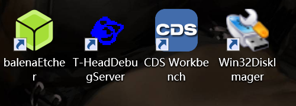
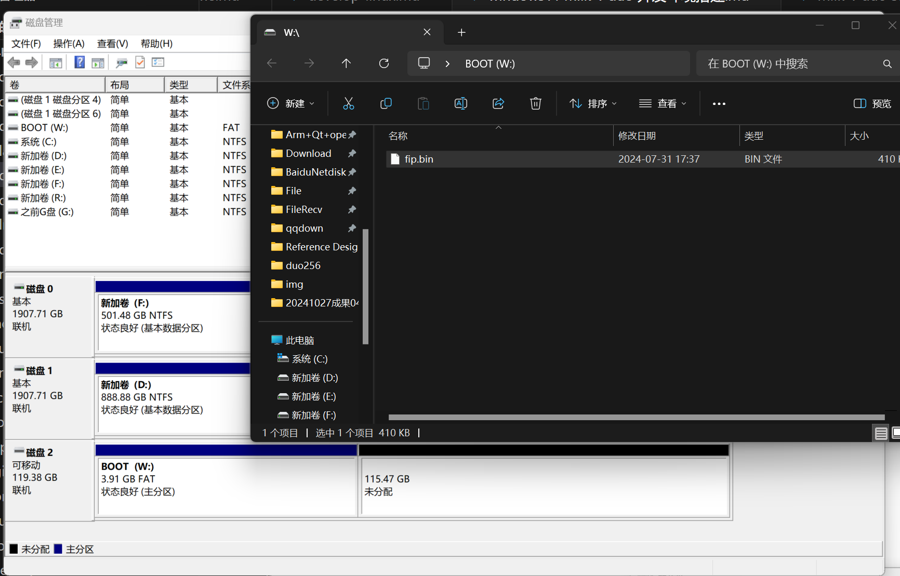
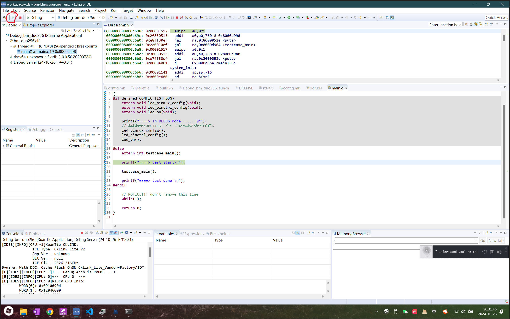
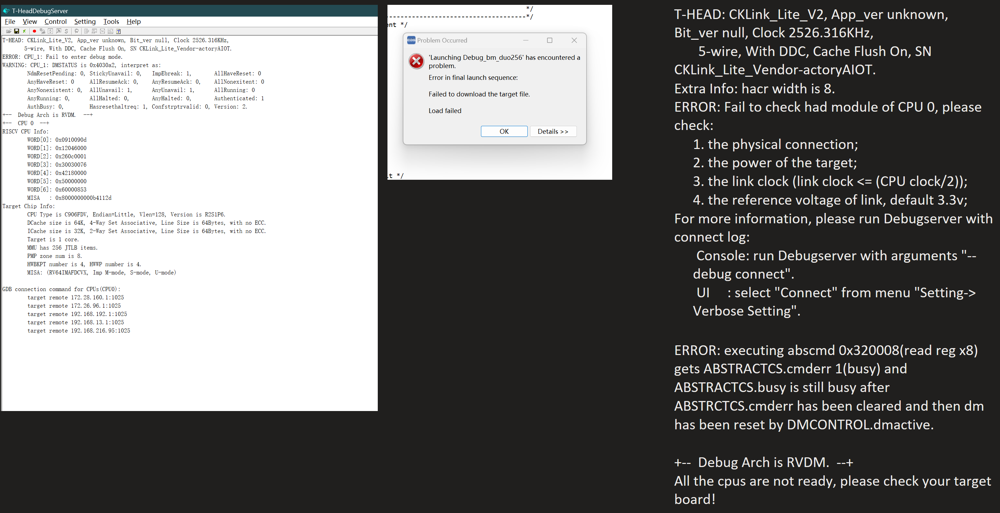

# windows11 milk-v duo 开发环境搭建和128G大容量卡烧写固件问题

## 准备材料

1，汪辰老师的教材文档 [https://github.com/unicornx/bm4duo/tree/main/docs](https://github.com/unicornx/bm4duo/tree/main/docs)

2，CKLink 调试器，[https://wiki.sipeed.com/hardware/zh/logic_analyzer/combo8/use_cklink_function.html](https://wiki.sipeed.com/hardware/zh/logic_analyzer/combo8/use_cklink_function.html)

3，下载 cds Workbench 和 T-headDebugServer 和 Win32DiskImager 和 balenaEtcher ，直接百度搜就能下到

## 128G大容量烧TF卡，烧写fip.bin固件

通过磁盘管理器删除卷，后分配出4G以内磁盘空间，格式化成FAT格式，

然后把固件直接复制进去，

## CKLink调试器接线

Milk-v Duo 256接线如下图，一根GND，四根CKLink的信号线 ，参考 SLogic Combo 8 使用文档[https://wiki.sipeed.com/hardware/zh/logic_analyzer/combo8/use_cklink_function.html](https://wiki.sipeed.com/hardware/zh/logic_analyzer/combo8/use_cklink_function.html)

## 完成

参考汪辰老师的教材文档 [https://github.com/unicornx/bm4duo/tree/main/docs](https://github.com/unicornx/bm4duo/tree/main/docs)，

打开 cds Workbench 导入项目，点击红圈的debug按钮，正常进入调试

打开 t-HeadDebugServer 也能正常识别出信息

## 128G大容量TF卡balenaEtcher烧录问题

如果用 balenaEtcher 直接烧录fip.bin固件，虽然显示烧录成功，但是磁盘无法正常使用，

因为磁盘被格式化成了未格式化的RAW磁盘分区

这时候打开t-HeadDebugServer 和 cds Workbench 会各种报错，异常

